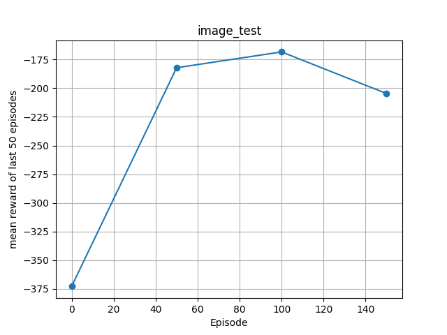
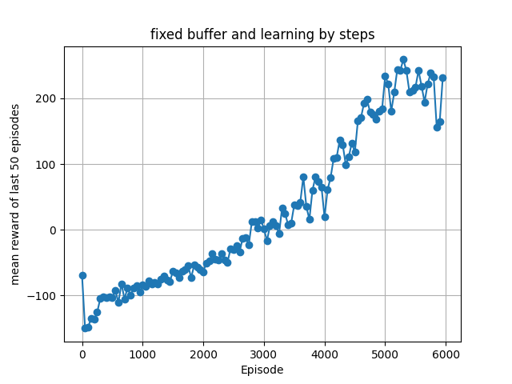
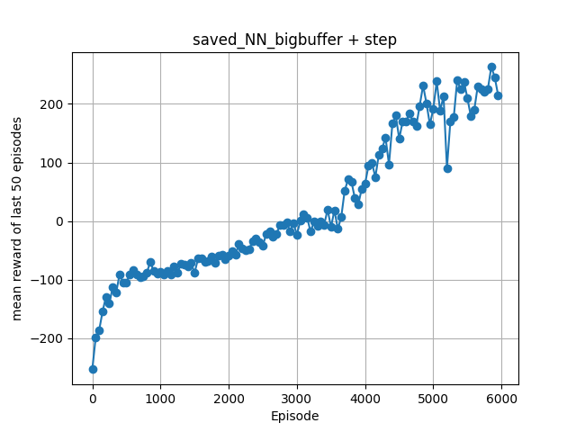
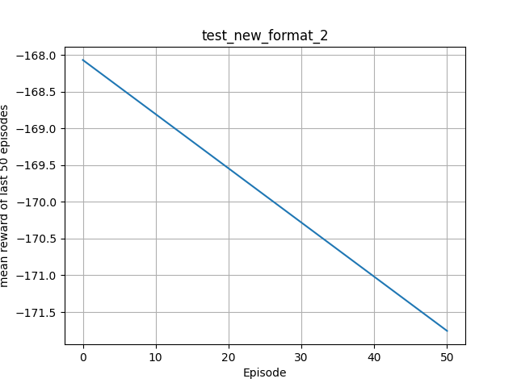
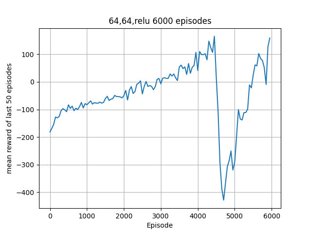
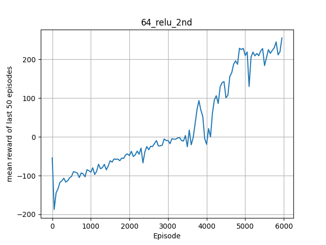
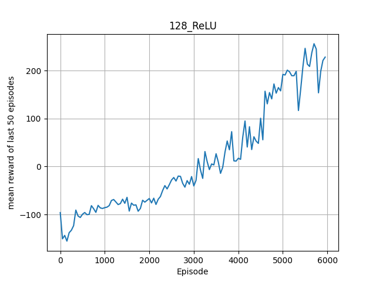
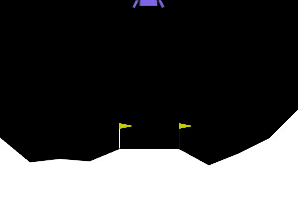

### this is not an official report
### this file serves as a data dump for various model implementation during work on the project
### for official report, open the file ???? TODO

#=== REPORT ===

note: this run was test of new logging function
memo: basic DQN, training done in batches, no normalisation, only one NN, random batches for better learning
Number of episodes: 200
Buffer size: 3000
Batch size: 64
Gamma: 0.99
Learning rate: 0.001

## Mean rewards

#=== REPORT ===

note: another test of logging function
memo: basic DQN, training done in batches, no normalisation, only one NN, random batches for better learning
Number of episodes: 200
Buffer size: 3000
Batch size: 64
Gamma: 0.99
Learning rate: 0.001

## Mean rewards

- Episode 0.0: -48.52
- Episode 50.0: -155.52
- Episode 100.0: -172.56
- Episode 150.0: -175.01
#================

#during training phase betterment of NN will be evaluated on 5000 episodes test runs 

#=== REPORT: LOG UPDATE TEST ===

note: test if program will work after changes in logging function
memo: basic DQN, training done in batches, no normalisation, only one NN, random batches for better learning
NN Layout: 8->64->RELU->64->RELU->4 (two hidden layers of 64 neurons, ReLU activation function, MSE loss function)
Number of episodes: 200
Buffer size: 3000
Batch size: 64
Gamma: 0.99
Learning rate: 0.001

## Mean rewards

- Episode 0.0: -83.63, epsilon: 1.00
- Episode 50.0: -174.24, epsilon: 0.99
- Episode 100.0: -174.25, epsilon: 0.99
- Episode 150.0: -178.28, epsilon: 0.98
#================

#=== REPORT: INITIAL NN test results ===

note: this was initial test of neural network, without improvements like normalising the inputs, rewards were steadely decreasing which is concerning
memo: basic DQN, training done in batches, no normalisation, only one NN, random batches for better learning
NN Layout: 8->64->RELU->64->RELU->4 (two hidden layers of 64 neurons, ReLU activation function, MSE loss function)
Number of episodes: 5000
Buffer size: 3000
Batch size: 64
Gamma: 0.99
Learning rate: 0.001

## Mean rewards

- Episode 0.0: -106.05, epsilon: 1.00
- Episode 50.0: -164.12, epsilon: 0.99
- Episode 100.0: -197.53, epsilon: 0.99
- Episode 150.0: -174.88, epsilon: 0.98
- Episode 200.0: -168.35, epsilon: 0.98
- Episode 250.0: -179.02, epsilon: 0.97
- Episode 300.0: -178.44, epsilon: 0.97
- Episode 350.0: -193.75, epsilon: 0.96
- Episode 400.0: -220.68, epsilon: 0.96
- Episode 450.0: -220.26, epsilon: 0.95
- Episode 500.0: -195.68, epsilon: 0.95
- Episode 550.0: -189.42, epsilon: 0.94
- Episode 600.0: -188.83, epsilon: 0.94
- Episode 650.0: -193.36, epsilon: 0.93
- Episode 700.0: -223.73, epsilon: 0.93
- Episode 750.0: -187.30, epsilon: 0.92
- Episode 800.0: -194.66, epsilon: 0.92
- Episode 850.0: -172.98, epsilon: 0.91
- Episode 900.0: -209.73, epsilon: 0.91
- Episode 950.0: -215.07, epsilon: 0.90
- Episode 1000.0: -208.73, epsilon: 0.90
- Episode 1050.0: -197.42, epsilon: 0.89
- Episode 1100.0: -186.32, epsilon: 0.89
- Episode 1150.0: -207.49, epsilon: 0.88
- Episode 1200.0: -185.72, epsilon: 0.88
- Episode 1250.0: -198.86, epsilon: 0.87
- Episode 1300.0: -226.90, epsilon: 0.87
- Episode 1350.0: -198.97, epsilon: 0.86
- Episode 1400.0: -256.87, epsilon: 0.86
- Episode 1450.0: -202.47, epsilon: 0.85
- Episode 1500.0: -210.02, epsilon: 0.85
- Episode 1550.0: -209.26, epsilon: 0.84
- Episode 1600.0: -226.01, epsilon: 0.84
- Episode 1650.0: -226.25, epsilon: 0.83
- Episode 1700.0: -208.03, epsilon: 0.83
- Episode 1750.0: -235.35, epsilon: 0.82
- Episode 1800.0: -239.24, epsilon: 0.82
- Episode 1850.0: -188.55, epsilon: 0.81
- Episode 1900.0: -240.72, epsilon: 0.81
- Episode 1950.0: -235.43, epsilon: 0.80
- Episode 2000.0: -217.32, epsilon: 0.80
- Episode 2050.0: -224.13, epsilon: 0.79
- Episode 2100.0: -216.60, epsilon: 0.79
- Episode 2150.0: -227.20, epsilon: 0.78
- Episode 2200.0: -260.57, epsilon: 0.78
- Episode 2250.0: -250.02, epsilon: 0.77
- Episode 2300.0: -262.05, epsilon: 0.77
- Episode 2350.0: -249.28, epsilon: 0.76
- Episode 2400.0: -264.95, epsilon: 0.76
- Episode 2450.0: -256.70, epsilon: 0.75
- Episode 2500.0: -273.27, epsilon: 0.75
- Episode 2550.0: -259.98, epsilon: 0.74
- Episode 2600.0: -266.38, epsilon: 0.74
- Episode 2650.0: -264.20, epsilon: 0.73
- Episode 2700.0: -290.07, epsilon: 0.73
- Episode 2750.0: -256.01, epsilon: 0.72
- Episode 2800.0: -300.10, epsilon: 0.72
- Episode 2850.0: -264.55, epsilon: 0.71
- Episode 2900.0: -298.84, epsilon: 0.71
- Episode 2950.0: -269.53, epsilon: 0.70
- Episode 3000.0: -298.08, epsilon: 0.70
- Episode 3050.0: -305.86, epsilon: 0.69
- Episode 3100.0: -250.43, epsilon: 0.69
- Episode 3150.0: -258.58, epsilon: 0.68
- Episode 3200.0: -308.22, epsilon: 0.68
- Episode 3250.0: -298.34, epsilon: 0.67
- Episode 3300.0: -295.55, epsilon: 0.67
- Episode 3350.0: -313.14, epsilon: 0.66
- Episode 3400.0: -296.77, epsilon: 0.66
- Episode 3450.0: -279.00, epsilon: 0.65
- Episode 3500.0: -315.70, epsilon: 0.65
- Episode 3550.0: -301.75, epsilon: 0.64
- Episode 3600.0: -300.50, epsilon: 0.64
- Episode 3650.0: -300.79, epsilon: 0.63
- Episode 3700.0: -282.85, epsilon: 0.63
- Episode 3750.0: -300.07, epsilon: 0.62
- Episode 3800.0: -317.91, epsilon: 0.62
- Episode 3850.0: -312.92, epsilon: 0.61
- Episode 3900.0: -334.88, epsilon: 0.61
- Episode 3950.0: -334.41, epsilon: 0.60
- Episode 4000.0: -356.07, epsilon: 0.60
- Episode 4050.0: -365.20, epsilon: 0.59
- Episode 4100.0: -302.61, epsilon: 0.59
- Episode 4150.0: -332.14, epsilon: 0.58
- Episode 4200.0: -332.72, epsilon: 0.58
- Episode 4250.0: -324.08, epsilon: 0.57
- Episode 4300.0: -321.05, epsilon: 0.57
- Episode 4350.0: -315.13, epsilon: 0.56
- Episode 4400.0: -344.64, epsilon: 0.56
- Episode 4450.0: -342.14, epsilon: 0.55
- Episode 4500.0: -319.19, epsilon: 0.55
- Episode 4550.0: -292.00, epsilon: 0.54
- Episode 4600.0: -322.70, epsilon: 0.54
- Episode 4650.0: -353.54, epsilon: 0.53
- Episode 4700.0: -323.84, epsilon: 0.53
- Episode 4750.0: -298.75, epsilon: 0.52
- Episode 4800.0: -380.70, epsilon: 0.52
- Episode 4850.0: -343.02, epsilon: 0.51
- Episode 4900.0: -389.65, epsilon: 0.51
- Episode 4950.0: -307.89, epsilon: 0.50
#================

#=== REPORT: Two NN feature ===

note: Added a second neural network only for calculating target in learning, updated by each 100 episodes. This made learning more stable and negated effect of Network "chasing its tail", results shown in the plot twoNN.png compared to previous ones further prove this claim
memo: basic DQN, training done in batches, no normalisation, only one NN, random batches for better learning
NN Layout: 8->64->RELU->64->RELU->4 (two hidden layers of 64 neurons, ReLU activation function, MSE loss function)
Number of episodes: 5000
Buffer size: 3000
Batch size: 64
Gamma: 0.99
Learning rate: 0.001

## Mean rewards

- Episode 0.0: -340.69, epsilon: 1.00
- Episode 50.0: -183.37, epsilon: 0.99
- Episode 100.0: -189.80, epsilon: 0.99
- Episode 150.0: -178.67, epsilon: 0.98
- Episode 200.0: -179.41, epsilon: 0.98
- Episode 250.0: -153.22, epsilon: 0.97
- Episode 300.0: -150.78, epsilon: 0.97
- Episode 350.0: -159.43, epsilon: 0.96
- Episode 400.0: -150.60, epsilon: 0.96
- Episode 450.0: -159.30, epsilon: 0.95
- Episode 500.0: -167.50, epsilon: 0.95
- Episode 550.0: -149.10, epsilon: 0.94
- Episode 600.0: -141.48, epsilon: 0.94
- Episode 650.0: -135.67, epsilon: 0.93
- Episode 700.0: -142.08, epsilon: 0.93
- Episode 750.0: -144.66, epsilon: 0.92
- Episode 800.0: -152.08, epsilon: 0.92
- Episode 850.0: -131.81, epsilon: 0.91
- Episode 900.0: -125.28, epsilon: 0.91
- Episode 950.0: -129.65, epsilon: 0.90
- Episode 1000.0: -121.78, epsilon: 0.90
- Episode 1050.0: -117.73, epsilon: 0.89
- Episode 1100.0: -132.30, epsilon: 0.89
- Episode 1150.0: -113.24, epsilon: 0.88
- Episode 1200.0: -124.24, epsilon: 0.88
- Episode 1250.0: -108.87, epsilon: 0.87
- Episode 1300.0: -126.87, epsilon: 0.87
- Episode 1350.0: -113.25, epsilon: 0.86
- Episode 1400.0: -108.98, epsilon: 0.86
- Episode 1450.0: -100.09, epsilon: 0.85
- Episode 1500.0: -116.29, epsilon: 0.85
- Episode 1550.0: -128.00, epsilon: 0.84
- Episode 1600.0: -101.74, epsilon: 0.84
- Episode 1650.0: -96.27, epsilon: 0.83
- Episode 1700.0: -97.89, epsilon: 0.83
- Episode 1750.0: -93.89, epsilon: 0.82
- Episode 1800.0: -104.16, epsilon: 0.82
- Episode 1850.0: -100.82, epsilon: 0.81
- Episode 1900.0: -96.06, epsilon: 0.81
- Episode 1950.0: -98.90, epsilon: 0.80
- Episode 2000.0: -97.31, epsilon: 0.80
- Episode 2050.0: -101.43, epsilon: 0.79
- Episode 2100.0: -86.91, epsilon: 0.79
- Episode 2150.0: -83.49, epsilon: 0.78
- Episode 2200.0: -89.16, epsilon: 0.78
- Episode 2250.0: -93.17, epsilon: 0.77
- Episode 2300.0: -80.38, epsilon: 0.77
- Episode 2350.0: -80.36, epsilon: 0.76
- Episode 2400.0: -84.98, epsilon: 0.76
- Episode 2450.0: -88.50, epsilon: 0.75
- Episode 2500.0: -76.95, epsilon: 0.75
- Episode 2550.0: -99.56, epsilon: 0.74
- Episode 2600.0: -76.94, epsilon: 0.74
- Episode 2650.0: -82.27, epsilon: 0.73
- Episode 2700.0: -81.52, epsilon: 0.73
- Episode 2750.0: -70.74, epsilon: 0.72
- Episode 2800.0: -71.88, epsilon: 0.72
- Episode 2850.0: -85.57, epsilon: 0.71
- Episode 2900.0: -76.33, epsilon: 0.71
- Episode 2950.0: -76.01, epsilon: 0.70
- Episode 3000.0: -74.03, epsilon: 0.70
- Episode 3050.0: -74.72, epsilon: 0.69
- Episode 3100.0: -65.67, epsilon: 0.69
- Episode 3150.0: -71.03, epsilon: 0.68
- Episode 3200.0: -75.03, epsilon: 0.68
- Episode 3250.0: -63.70, epsilon: 0.67
- Episode 3300.0: -75.01, epsilon: 0.67
- Episode 3350.0: -54.81, epsilon: 0.66
- Episode 3400.0: -70.13, epsilon: 0.66
- Episode 3450.0: -62.52, epsilon: 0.65
- Episode 3500.0: -64.14, epsilon: 0.65
- Episode 3550.0: -64.74, epsilon: 0.64
- Episode 3600.0: -64.83, epsilon: 0.64
- Episode 3650.0: -56.07, epsilon: 0.63
- Episode 3700.0: -57.48, epsilon: 0.63
- Episode 3750.0: -50.41, epsilon: 0.62
- Episode 3800.0: -49.30, epsilon: 0.62
- Episode 3850.0: -70.59, epsilon: 0.61
- Episode 3900.0: -70.94, epsilon: 0.61
- Episode 3950.0: -73.56, epsilon: 0.60
- Episode 4000.0: -61.62, epsilon: 0.60
- Episode 4050.0: -69.11, epsilon: 0.59
- Episode 4100.0: -65.56, epsilon: 0.59
- Episode 4150.0: -78.59, epsilon: 0.58
- Episode 4200.0: -65.05, epsilon: 0.58
- Episode 4250.0: -79.17, epsilon: 0.57
- Episode 4300.0: -68.70, epsilon: 0.57
- Episode 4350.0: -54.27, epsilon: 0.56
- Episode 4400.0: -41.93, epsilon: 0.56
- Episode 4450.0: -50.69, epsilon: 0.55
- Episode 4500.0: -50.69, epsilon: 0.55
- Episode 4550.0: -65.55, epsilon: 0.54
- Episode 4600.0: -53.98, epsilon: 0.54
- Episode 4650.0: -52.56, epsilon: 0.53
- Episode 4700.0: -50.50, epsilon: 0.53
- Episode 4750.0: -59.92, epsilon: 0.52
- Episode 4800.0: -75.68, epsilon: 0.52
- Episode 4850.0: -63.59, epsilon: 0.51
- Episode 4900.0: -71.54, epsilon: 0.51
- Episode 4950.0: -51.42, epsilon: 0.50
#================

#=== REPORT: TWO NN AND NORMALISATION ===

note: after adding normalisation recent rewards got even better results
memo: basic DQN, training done in batches, no normalisation, only one NN, random batches for better learning
NN Layout: 8->64->RELU->64->RELU->4 (two hidden layers of 64 neurons, ReLU activation function, MSE loss function)
Number of episodes: 5000
Buffer size: 3000
Batch size: 64
Gamma: 0.99
Learning rate: 0.001

## Mean rewards

- Episode 0.0: -107.08, epsilon: 1.00
- Episode 50.0: -156.47, epsilon: 0.99
- Episode 100.0: -193.21, epsilon: 0.99
- Episode 150.0: -166.59, epsilon: 0.98
- Episode 200.0: -174.64, epsilon: 0.98
- Episode 250.0: -182.23, epsilon: 0.97
- Episode 300.0: -164.34, epsilon: 0.97
- Episode 350.0: -157.46, epsilon: 0.96
- Episode 400.0: -138.45, epsilon: 0.96
- Episode 450.0: -151.38, epsilon: 0.95
- Episode 500.0: -156.80, epsilon: 0.95
- Episode 550.0: -157.90, epsilon: 0.94
- Episode 600.0: -148.08, epsilon: 0.94
- Episode 650.0: -163.67, epsilon: 0.93
- Episode 700.0: -149.38, epsilon: 0.93
- Episode 750.0: -121.35, epsilon: 0.92
- Episode 800.0: -126.83, epsilon: 0.92
- Episode 850.0: -140.15, epsilon: 0.91
- Episode 900.0: -125.62, epsilon: 0.91
- Episode 950.0: -138.27, epsilon: 0.90
- Episode 1000.0: -135.84, epsilon: 0.90
- Episode 1050.0: -134.07, epsilon: 0.89
- Episode 1100.0: -130.45, epsilon: 0.89
- Episode 1150.0: -104.40, epsilon: 0.88
- Episode 1200.0: -138.62, epsilon: 0.88
- Episode 1250.0: -101.19, epsilon: 0.87
- Episode 1300.0: -121.82, epsilon: 0.87
- Episode 1350.0: -110.96, epsilon: 0.86
- Episode 1400.0: -124.06, epsilon: 0.86
- Episode 1450.0: -113.67, epsilon: 0.85
- Episode 1500.0: -111.40, epsilon: 0.85
- Episode 1550.0: -103.66, epsilon: 0.84
- Episode 1600.0: -98.71, epsilon: 0.84
- Episode 1650.0: -98.23, epsilon: 0.83
- Episode 1700.0: -92.09, epsilon: 0.83
- Episode 1750.0: -96.89, epsilon: 0.82
- Episode 1800.0: -88.75, epsilon: 0.82
- Episode 1850.0: -97.16, epsilon: 0.81
- Episode 1900.0: -89.55, epsilon: 0.81
- Episode 1950.0: -95.02, epsilon: 0.80
- Episode 2000.0: -86.76, epsilon: 0.80
- Episode 2050.0: -83.65, epsilon: 0.79
- Episode 2100.0: -84.26, epsilon: 0.79
- Episode 2150.0: -80.17, epsilon: 0.78
- Episode 2200.0: -84.34, epsilon: 0.78
- Episode 2250.0: -90.89, epsilon: 0.77
- Episode 2300.0: -74.84, epsilon: 0.77
- Episode 2350.0: -80.48, epsilon: 0.76
- Episode 2400.0: -83.12, epsilon: 0.76
- Episode 2450.0: -75.93, epsilon: 0.75
- Episode 2500.0: -85.78, epsilon: 0.75
- Episode 2550.0: -83.57, epsilon: 0.74
- Episode 2600.0: -77.92, epsilon: 0.74
- Episode 2650.0: -90.11, epsilon: 0.73
- Episode 2700.0: -77.85, epsilon: 0.73
- Episode 2750.0: -79.91, epsilon: 0.72
- Episode 2800.0: -81.69, epsilon: 0.72
- Episode 2850.0: -77.01, epsilon: 0.71
- Episode 2900.0: -90.86, epsilon: 0.71
- Episode 2950.0: -81.27, epsilon: 0.70
- Episode 3000.0: -80.09, epsilon: 0.70
- Episode 3050.0: -71.44, epsilon: 0.69
- Episode 3100.0: -72.13, epsilon: 0.69
- Episode 3150.0: -76.52, epsilon: 0.68
- Episode 3200.0: -82.49, epsilon: 0.68
- Episode 3250.0: -77.00, epsilon: 0.67
- Episode 3300.0: -80.16, epsilon: 0.67
- Episode 3350.0: -76.06, epsilon: 0.66
- Episode 3400.0: -69.31, epsilon: 0.66
- Episode 3450.0: -66.24, epsilon: 0.65
- Episode 3500.0: -70.36, epsilon: 0.65
- Episode 3550.0: -75.64, epsilon: 0.64
- Episode 3600.0: -73.05, epsilon: 0.64
- Episode 3650.0: -76.06, epsilon: 0.63
- Episode 3700.0: -68.50, epsilon: 0.63
- Episode 3750.0: -65.57, epsilon: 0.62
- Episode 3800.0: -66.47, epsilon: 0.62
- Episode 3850.0: -64.14, epsilon: 0.61
- Episode 3900.0: -64.74, epsilon: 0.61
- Episode 3950.0: -60.39, epsilon: 0.60
- Episode 4000.0: -61.80, epsilon: 0.60
- Episode 4050.0: -59.80, epsilon: 0.59
- Episode 4100.0: -52.90, epsilon: 0.59
- Episode 4150.0: -63.92, epsilon: 0.58
- Episode 4200.0: -44.78, epsilon: 0.58
- Episode 4250.0: -40.11, epsilon: 0.57
- Episode 4300.0: -48.74, epsilon: 0.57
- Episode 4350.0: -60.92, epsilon: 0.56
- Episode 4400.0: -48.79, epsilon: 0.56
- Episode 4450.0: -40.28, epsilon: 0.55
- Episode 4500.0: -56.89, epsilon: 0.55
- Episode 4550.0: -49.86, epsilon: 0.54
- Episode 4600.0: -47.27, epsilon: 0.54
- Episode 4650.0: -43.52, epsilon: 0.53
- Episode 4700.0: -42.18, epsilon: 0.53
- Episode 4750.0: -46.55, epsilon: 0.52
- Episode 4800.0: -40.93, epsilon: 0.52
- Episode 4850.0: -39.18, epsilon: 0.51
- Episode 4900.0: -54.26, epsilon: 0.51
- Episode 4950.0: -42.23, epsilon: 0.50
#================

#=== REPORT: Two NN + Norm 30k episodes ===

note: This time model performed well until it reached mean positive rewards and then it started to get worse results. Besides that, data structure needs to be reworked, because of the computational complexity of .pop(0) method of O(n). Without that training will be much longer and research will be harder
memo: basic DQN, training done in batches, no normalisation, only one NN, random batches for better learning
NN Layout: 8->64->RELU->64->RELU->4 (two hidden layers of 64 neurons, ReLU activation function, MSE loss function)
Number of episodes: 11000
Buffer size: 3000
Batch size: 64
Gamma: 0.99
Learning rate: 0.001

## Mean rewards

- Episode 0.0: -281.72, epsilon: 1.00
- Episode 50.0: -175.45, epsilon: 0.99
- Episode 100.0: -188.36, epsilon: 0.99
- Episode 150.0: -163.81, epsilon: 0.98
- Episode 200.0: -149.85, epsilon: 0.98
- Episode 250.0: -173.24, epsilon: 0.97
- Episode 300.0: -183.92, epsilon: 0.97
- Episode 350.0: -172.23, epsilon: 0.96
- Episode 400.0: -169.77, epsilon: 0.96
- Episode 450.0: -159.75, epsilon: 0.95
- Episode 500.0: -162.37, epsilon: 0.95
- Episode 550.0: -162.00, epsilon: 0.94
- Episode 600.0: -159.29, epsilon: 0.94
- Episode 650.0: -169.39, epsilon: 0.93
- Episode 700.0: -156.55, epsilon: 0.93
- Episode 750.0: -164.61, epsilon: 0.92
- Episode 800.0: -114.62, epsilon: 0.92
- Episode 850.0: -128.61, epsilon: 0.91
- Episode 900.0: -130.89, epsilon: 0.91
- Episode 950.0: -118.04, epsilon: 0.90
- Episode 1000.0: -151.07, epsilon: 0.90
- Episode 1050.0: -145.75, epsilon: 0.89
- Episode 1100.0: -134.61, epsilon: 0.89
- Episode 1150.0: -113.82, epsilon: 0.88
- Episode 1200.0: -110.50, epsilon: 0.88
- Episode 1250.0: -111.07, epsilon: 0.87
- Episode 1300.0: -132.37, epsilon: 0.87
- Episode 1350.0: -112.91, epsilon: 0.86
- Episode 1400.0: -118.84, epsilon: 0.86
- Episode 1450.0: -111.68, epsilon: 0.85
- Episode 1500.0: -104.71, epsilon: 0.85
- Episode 1550.0: -128.51, epsilon: 0.84
- Episode 1600.0: -120.50, epsilon: 0.84
- Episode 1650.0: -97.63, epsilon: 0.83
- Episode 1700.0: -90.51, epsilon: 0.83
- Episode 1750.0: -105.22, epsilon: 0.82
- Episode 1800.0: -96.91, epsilon: 0.82
- Episode 1850.0: -91.82, epsilon: 0.81
- Episode 1900.0: -110.21, epsilon: 0.81
- Episode 1950.0: -94.67, epsilon: 0.80
- Episode 2000.0: -87.19, epsilon: 0.80
- Episode 2050.0: -79.37, epsilon: 0.79
- Episode 2100.0: -88.77, epsilon: 0.79
- Episode 2150.0: -83.22, epsilon: 0.78
- Episode 2200.0: -86.95, epsilon: 0.78
- Episode 2250.0: -86.17, epsilon: 0.77
- Episode 2300.0: -85.25, epsilon: 0.77
- Episode 2350.0: -83.84, epsilon: 0.76
- Episode 2400.0: -86.64, epsilon: 0.76
- Episode 2450.0: -94.31, epsilon: 0.75
- Episode 2500.0: -80.27, epsilon: 0.75
- Episode 2550.0: -79.19, epsilon: 0.74
- Episode 2600.0: -87.86, epsilon: 0.74
- Episode 2650.0: -72.90, epsilon: 0.73
- Episode 2700.0: -64.82, epsilon: 0.73
- Episode 2750.0: -69.30, epsilon: 0.72
- Episode 2800.0: -79.19, epsilon: 0.72
- Episode 2850.0: -73.39, epsilon: 0.71
- Episode 2900.0: -78.49, epsilon: 0.71
- Episode 2950.0: -78.18, epsilon: 0.70
- Episode 3000.0: -66.41, epsilon: 0.70
- Episode 3050.0: -76.98, epsilon: 0.69
- Episode 3100.0: -71.41, epsilon: 0.69
- Episode 3150.0: -73.37, epsilon: 0.68
- Episode 3200.0: -76.82, epsilon: 0.68
- Episode 3250.0: -63.96, epsilon: 0.67
- Episode 3300.0: -63.63, epsilon: 0.67
- Episode 3350.0: -65.38, epsilon: 0.66
- Episode 3400.0: -61.50, epsilon: 0.66
- Episode 3450.0: -65.06, epsilon: 0.65
- Episode 3500.0: -54.93, epsilon: 0.65
- Episode 3550.0: -66.62, epsilon: 0.64
- Episode 3600.0: -66.85, epsilon: 0.64
- Episode 3650.0: -57.84, epsilon: 0.63
- Episode 3700.0: -61.94, epsilon: 0.63
- Episode 3750.0: -53.73, epsilon: 0.62
- Episode 3800.0: -52.89, epsilon: 0.62
- Episode 3850.0: -62.02, epsilon: 0.61
- Episode 3900.0: -61.16, epsilon: 0.61
- Episode 3950.0: -57.83, epsilon: 0.60
- Episode 4000.0: -62.61, epsilon: 0.60
- Episode 4050.0: -54.46, epsilon: 0.59
- Episode 4100.0: -50.70, epsilon: 0.59
- Episode 4150.0: -46.80, epsilon: 0.58
- Episode 4200.0: -63.00, epsilon: 0.58
- Episode 4250.0: -46.55, epsilon: 0.57
- Episode 4300.0: -58.02, epsilon: 0.57
- Episode 4350.0: -56.32, epsilon: 0.56
- Episode 4400.0: -50.44, epsilon: 0.56
- Episode 4450.0: -49.67, epsilon: 0.55
- Episode 4500.0: -41.27, epsilon: 0.55
- Episode 4550.0: -43.34, epsilon: 0.54
- Episode 4600.0: -52.36, epsilon: 0.54
- Episode 4650.0: -54.09, epsilon: 0.53
- Episode 4700.0: -43.24, epsilon: 0.53
- Episode 4750.0: -42.13, epsilon: 0.52
- Episode 4800.0: -50.58, epsilon: 0.52
- Episode 4850.0: -38.02, epsilon: 0.51
- Episode 4900.0: -40.03, epsilon: 0.51
- Episode 4950.0: -37.94, epsilon: 0.50
- Episode 5000.0: -36.97, epsilon: 0.50
- Episode 5050.0: -42.89, epsilon: 0.49
- Episode 5100.0: -36.55, epsilon: 0.49
- Episode 5150.0: -27.80, epsilon: 0.48
- Episode 5200.0: -30.10, epsilon: 0.48
- Episode 5250.0: -37.45, epsilon: 0.47
- Episode 5300.0: -37.73, epsilon: 0.47
- Episode 5350.0: -25.87, epsilon: 0.46
- Episode 5400.0: -26.11, epsilon: 0.46
- Episode 5450.0: -26.99, epsilon: 0.45
- Episode 5500.0: -39.93, epsilon: 0.45
- Episode 5550.0: -31.84, epsilon: 0.44
- Episode 5600.0: -26.53, epsilon: 0.44
- Episode 5650.0: -32.59, epsilon: 0.43
- Episode 5700.0: -41.29, epsilon: 0.43
- Episode 5750.0: -34.23, epsilon: 0.42
- Episode 5800.0: -31.14, epsilon: 0.42
- Episode 5850.0: -30.99, epsilon: 0.41
- Episode 5900.0: -27.06, epsilon: 0.41
- Episode 5950.0: -32.34, epsilon: 0.40
- Episode 6000.0: -28.68, epsilon: 0.40
- Episode 6050.0: -39.91, epsilon: 0.39
- Episode 6100.0: -31.43, epsilon: 0.39
- Episode 6150.0: -26.12, epsilon: 0.38
- Episode 6200.0: -26.91, epsilon: 0.38
- Episode 6250.0: -28.53, epsilon: 0.37
- Episode 6300.0: 4.55, epsilon: 0.37
- Episode 6350.0: -15.02, epsilon: 0.36
- Episode 6400.0: -0.15, epsilon: 0.36
- Episode 6450.0: -17.33, epsilon: 0.35
- Episode 6500.0: -48.79, epsilon: 0.35
- Episode 6550.0: -39.14, epsilon: 0.34
- Episode 6600.0: -33.61, epsilon: 0.34
- Episode 6650.0: -39.80, epsilon: 0.33
- Episode 6700.0: -54.48, epsilon: 0.33
- Episode 6750.0: -21.31, epsilon: 0.32
- Episode 6800.0: -46.74, epsilon: 0.32
- Episode 6850.0: -23.78, epsilon: 0.31
- Episode 6900.0: -21.87, epsilon: 0.31
- Episode 6950.0: -51.64, epsilon: 0.30
- Episode 7000.0: -26.49, epsilon: 0.30
- Episode 7050.0: -51.78, epsilon: 0.29
- Episode 7100.0: -89.57, epsilon: 0.29
- Episode 7150.0: -93.60, epsilon: 0.28
- Episode 7200.0: -97.09, epsilon: 0.28
- Episode 7250.0: -68.17, epsilon: 0.27
- Episode 7300.0: -72.87, epsilon: 0.27
- Episode 7350.0: -53.97, epsilon: 0.26
- Episode 7400.0: -78.67, epsilon: 0.26
- Episode 7450.0: -90.42, epsilon: 0.25
- Episode 7500.0: -60.47, epsilon: 0.25
- Episode 7550.0: -73.32, epsilon: 0.24
- Episode 7600.0: -69.23, epsilon: 0.24
- Episode 7650.0: -94.53, epsilon: 0.23
- Episode 7700.0: -79.56, epsilon: 0.23
- Episode 7750.0: -55.32, epsilon: 0.22
- Episode 7800.0: -58.30, epsilon: 0.22
- Episode 7850.0: -17.81, epsilon: 0.21
- Episode 7900.0: -67.97, epsilon: 0.21
- Episode 7950.0: -85.57, epsilon: 0.20
- Episode 8000.0: -60.18, epsilon: 0.20
- Episode 8050.0: -56.82, epsilon: 0.19
- Episode 8100.0: -40.09, epsilon: 0.19
- Episode 8150.0: -65.89, epsilon: 0.18
- Episode 8200.0: -40.09, epsilon: 0.18
- Episode 8250.0: -7.00, epsilon: 0.17
- Episode 8300.0: -59.62, epsilon: 0.17
- Episode 8350.0: -73.65, epsilon: 0.16
- Episode 8400.0: -60.64, epsilon: 0.16
- Episode 8450.0: -99.89, epsilon: 0.15
- Episode 8500.0: -60.31, epsilon: 0.15
- Episode 8550.0: -64.19, epsilon: 0.14
- Episode 8600.0: -50.18, epsilon: 0.14
- Episode 8650.0: -75.43, epsilon: 0.13
- Episode 8700.0: -87.96, epsilon: 0.13
- Episode 8750.0: -31.20, epsilon: 0.12
- Episode 8800.0: -53.50, epsilon: 0.12
- Episode 8850.0: -50.61, epsilon: 0.11
- Episode 8900.0: -50.56, epsilon: 0.11
- Episode 8950.0: -86.86, epsilon: 0.10
- Episode 9000.0: -94.88, epsilon: 0.10
- Episode 9050.0: -55.50, epsilon: 0.10
- Episode 9100.0: -53.11, epsilon: 0.10
- Episode 9150.0: -56.59, epsilon: 0.10
- Episode 9200.0: -55.18, epsilon: 0.10
- Episode 9250.0: -56.01, epsilon: 0.10
- Episode 9300.0: -73.76, epsilon: 0.10
- Episode 9350.0: -33.38, epsilon: 0.10
- Episode 9400.0: -62.56, epsilon: 0.10
- Episode 9450.0: -41.11, epsilon: 0.10
- Episode 9500.0: -28.23, epsilon: 0.10
- Episode 9550.0: -4.92, epsilon: 0.10
- Episode 9600.0: -8.21, epsilon: 0.10
- Episode 9650.0: -5.76, epsilon: 0.10
- Episode 9700.0: -70.98, epsilon: 0.10
- Episode 9750.0: -88.35, epsilon: 0.10
- Episode 9800.0: -31.49, epsilon: 0.10
- Episode 9850.0: -42.60, epsilon: 0.10
- Episode 9900.0: -45.63, epsilon: 0.10
- Episode 9950.0: -42.34, epsilon: 0.10
- Episode 10000.0: -26.22, epsilon: 0.10
- Episode 10050.0: -42.92, epsilon: 0.10
- Episode 10100.0: -53.04, epsilon: 0.10
- Episode 10150.0: -38.49, epsilon: 0.10
- Episode 10200.0: -90.15, epsilon: 0.10
- Episode 10250.0: -57.62, epsilon: 0.10
- Episode 10300.0: -91.53, epsilon: 0.10
- Episode 10350.0: -101.26, epsilon: 0.10
- Episode 10400.0: -71.00, epsilon: 0.10
- Episode 10450.0: -63.37, epsilon: 0.10
- Episode 10500.0: -58.97, epsilon: 0.10
- Episode 10550.0: -69.76, epsilon: 0.10
- Episode 10600.0: -105.85, epsilon: 0.10
- Episode 10650.0: -118.72, epsilon: 0.10
- Episode 10700.0: -186.65, epsilon: 0.10
- Episode 10750.0: -106.45, epsilon: 0.10
- Episode 10800.0: -124.47, epsilon: 0.10
- Episode 10850.0: -161.79, epsilon: 0.10
- Episode 10900.0: -144.63, epsilon: 0.10
- Episode 10950.0: -139.21, epsilon: 0.10
#================

#=== REPORT: test_report ===

note: test report, to discard
memo: basic DQN, training done in batches, no normalisation, only one NN, random batches for better learning
NN Layout: 8->64->RELU->64->RELU->4 (two hidden layers of 64 neurons, ReLU activation function, MSE loss function)
Number of episodes: 200
Buffer size: 3000
Batch size: 64
Gamma: 0.99
Learning rate: 0.001

## Mean rewards

- Episode 0.0: -149.29, epsilon: 1.00
- Episode 50.0: -186.36, epsilon: 0.99
- Episode 100.0: -175.24, epsilon: 0.99
- Episode 150.0: -150.22, epsilon: 0.98
#================

#=== REPORT: image_saving ===

note: image saving in markdown test, to discard
memo: basic DQN, training done in batches, no normalisation, only one NN, random batches for better learning
NN Layout: 8->64->RELU->64->RELU->4 (two hidden layers of 64 neurons, ReLU activation function, MSE loss function)
Number of episodes: 200
Buffer size: 3000
Batch size: 64
Gamma: 0.99
Learning rate: 0.001

## Mean rewards

- Episode 0.0: -372.88, epsilon: 1.00
- Episode 50.0: -182.14, epsilon: 0.99
- Episode 100.0: -168.34, epsilon: 0.99
- Episode 150.0: -204.63, epsilon: 0.98
#================

#=== REPORT: FIXED TARGET UPDATING & BIGGER BUFFER ===

note: In this training it was confirmed that each step takes same ammount of time no matter the episode, latter episodes takes longer because model is better trained and the lander is longer afloat. Longer afloat time also mean more steps each episode, which was bad for target updating determined by episodes and not steps. After reaching some threshold episodes started taking many more steps, and previous version started degrading. In this one updating target network is done by every 1000 steps not 100 episodes, which greatly improved learning possibilieties of NN compared to the previous one
Number of episodes: 6000
Buffer size: 50000
Batch size: 64
Gamma: 0.99
Learning rate: 0.001

## Mean rewards

- Episode 0.0: -69.82, epsilon: 0.90
- Episode 50.0: -150.14, epsilon: 0.89
- Episode 100.0: -147.96, epsilon: 0.88
- Episode 150.0: -135.30, epsilon: 0.88
- Episode 200.0: -136.58, epsilon: 0.87
- Episode 250.0: -125.75, epsilon: 0.86
- Episode 300.0: -105.07, epsilon: 0.85
- Episode 350.0: -102.55, epsilon: 0.84
- Episode 400.0: -102.99, epsilon: 0.84
- Episode 450.0: -102.31, epsilon: 0.83
- Episode 500.0: -103.06, epsilon: 0.82
- Episode 550.0: -92.61, epsilon: 0.81
- Episode 600.0: -110.77, epsilon: 0.80
- Episode 650.0: -82.06, epsilon: 0.80
- Episode 700.0: -105.39, epsilon: 0.79
- Episode 750.0: -88.85, epsilon: 0.78
- Episode 800.0: -99.83, epsilon: 0.77
- Episode 850.0: -88.61, epsilon: 0.76
- Episode 900.0: -85.65, epsilon: 0.76
- Episode 950.0: -95.00, epsilon: 0.75
- Episode 1000.0: -83.92, epsilon: 0.74
- Episode 1050.0: -86.74, epsilon: 0.73
- Episode 1100.0: -77.80, epsilon: 0.72
- Episode 1150.0: -83.07, epsilon: 0.72
- Episode 1200.0: -80.12, epsilon: 0.71
- Episode 1250.0: -82.98, epsilon: 0.70
- Episode 1300.0: -74.87, epsilon: 0.69
- Episode 1350.0: -70.39, epsilon: 0.68
- Episode 1400.0: -76.77, epsilon: 0.68
- Episode 1450.0: -78.51, epsilon: 0.67
- Episode 1500.0: -63.10, epsilon: 0.66
- Episode 1550.0: -65.15, epsilon: 0.65
- Episode 1600.0: -72.33, epsilon: 0.64
- Episode 1650.0: -62.61, epsilon: 0.64
- Episode 1700.0: -61.32, epsilon: 0.63
- Episode 1750.0: -54.50, epsilon: 0.62
- Episode 1800.0: -73.15, epsilon: 0.61
- Episode 1850.0: -53.91, epsilon: 0.60
- Episode 1900.0: -57.68, epsilon: 0.60
- Episode 1950.0: -61.12, epsilon: 0.59
- Episode 2000.0: -63.93, epsilon: 0.58
- Episode 2050.0: -50.57, epsilon: 0.57
- Episode 2100.0: -47.78, epsilon: 0.56
- Episode 2150.0: -36.95, epsilon: 0.56
- Episode 2200.0: -45.40, epsilon: 0.55
- Episode 2250.0: -46.15, epsilon: 0.54
- Episode 2300.0: -36.40, epsilon: 0.53
- Episode 2350.0: -46.23, epsilon: 0.52
- Episode 2400.0: -49.39, epsilon: 0.52
- Episode 2450.0: -28.65, epsilon: 0.51
- Episode 2500.0: -29.84, epsilon: 0.50
- Episode 2550.0: -24.28, epsilon: 0.49
- Episode 2600.0: -33.35, epsilon: 0.48
- Episode 2650.0: -12.92, epsilon: 0.48
- Episode 2700.0: -11.63, epsilon: 0.47
- Episode 2750.0: -23.47, epsilon: 0.46
- Episode 2800.0: 11.85, epsilon: 0.45
- Episode 2850.0: 12.17, epsilon: 0.44
- Episode 2900.0: 2.63, epsilon: 0.44
- Episode 2950.0: 14.78, epsilon: 0.43
- Episode 3000.0: 1.74, epsilon: 0.42
- Episode 3050.0: -16.78, epsilon: 0.41
- Episode 3100.0: 5.77, epsilon: 0.40
- Episode 3150.0: 12.38, epsilon: 0.40
- Episode 3200.0: 6.03, epsilon: 0.39
- Episode 3250.0: -6.09, epsilon: 0.38
- Episode 3300.0: 33.53, epsilon: 0.37
- Episode 3350.0: 24.59, epsilon: 0.36
- Episode 3400.0: 7.01, epsilon: 0.36
- Episode 3450.0: 10.34, epsilon: 0.35
- Episode 3500.0: 37.62, epsilon: 0.34
- Episode 3550.0: 36.66, epsilon: 0.33
- Episode 3600.0: 42.07, epsilon: 0.32
- Episode 3650.0: 80.69, epsilon: 0.32
- Episode 3700.0: 35.08, epsilon: 0.31
- Episode 3750.0: 15.59, epsilon: 0.30
- Episode 3800.0: 59.67, epsilon: 0.29
- Episode 3850.0: 80.30, epsilon: 0.28
- Episode 3900.0: 73.66, epsilon: 0.28
- Episode 3950.0: 64.98, epsilon: 0.27
- Episode 4000.0: 19.19, epsilon: 0.26
- Episode 4050.0: 60.74, epsilon: 0.25
- Episode 4100.0: 79.61, epsilon: 0.24
- Episode 4150.0: 108.22, epsilon: 0.24
- Episode 4200.0: 110.07, epsilon: 0.23
- Episode 4250.0: 136.57, epsilon: 0.22
- Episode 4300.0: 129.40, epsilon: 0.21
- Episode 4350.0: 99.01, epsilon: 0.20
- Episode 4400.0: 111.24, epsilon: 0.20
- Episode 4450.0: 132.18, epsilon: 0.19
- Episode 4500.0: 118.13, epsilon: 0.18
- Episode 4550.0: 165.88, epsilon: 0.17
- Episode 4600.0: 170.29, epsilon: 0.16
- Episode 4650.0: 192.13, epsilon: 0.16
- Episode 4700.0: 198.27, epsilon: 0.15
- Episode 4750.0: 179.76, epsilon: 0.14
- Episode 4800.0: 176.08, epsilon: 0.13
- Episode 4850.0: 167.74, epsilon: 0.12
- Episode 4900.0: 180.49, epsilon: 0.12
- Episode 4950.0: 184.68, epsilon: 0.11
- Episode 5000.0: 233.98, epsilon: 0.10
- Episode 5050.0: 221.96, epsilon: 0.10
- Episode 5100.0: 180.38, epsilon: 0.10
- Episode 5150.0: 209.26, epsilon: 0.10
- Episode 5200.0: 244.11, epsilon: 0.10
- Episode 5250.0: 242.82, epsilon: 0.10
- Episode 5300.0: 259.15, epsilon: 0.10
- Episode 5350.0: 242.05, epsilon: 0.10
- Episode 5400.0: 209.89, epsilon: 0.10
- Episode 5450.0: 212.41, epsilon: 0.10
- Episode 5500.0: 217.03, epsilon: 0.10
- Episode 5550.0: 242.36, epsilon: 0.10
- Episode 5600.0: 218.81, epsilon: 0.10
- Episode 5650.0: 194.33, epsilon: 0.10
- Episode 5700.0: 221.62, epsilon: 0.10
- Episode 5750.0: 238.36, epsilon: 0.10
- Episode 5800.0: 232.64, epsilon: 0.10
- Episode 5850.0: 156.06, epsilon: 0.10
- Episode 5900.0: 164.84, epsilon: 0.10
- Episode 5950.0: 231.89, epsilon: 0.10
#================

#=== REPORT: same as previously, this time network was saved into a file ===

note: ...
---------------------
Number of episodes: 6000
Buffer size: 50000
Batch size: 64
First hidden layer size: 64
Second hidden layer: 64
Gamma: 0.99
Learning rate: 0.001

## Mean rewards

- Episode 0.0: -253.28, epsilon: 0.90
- Episode 50.0: -198.63, epsilon: 0.89
- Episode 100.0: -186.86, epsilon: 0.88
- Episode 150.0: -154.99, epsilon: 0.88
- Episode 200.0: -129.50, epsilon: 0.87
- Episode 250.0: -141.04, epsilon: 0.86
- Episode 300.0: -112.34, epsilon: 0.85
- Episode 350.0: -122.33, epsilon: 0.84
- Episode 400.0: -90.95, epsilon: 0.84
- Episode 450.0: -104.37, epsilon: 0.83
- Episode 500.0: -105.24, epsilon: 0.82
- Episode 550.0: -90.75, epsilon: 0.81
- Episode 600.0: -83.92, epsilon: 0.80
- Episode 650.0: -91.17, epsilon: 0.80
- Episode 700.0: -95.28, epsilon: 0.79
- Episode 750.0: -94.70, epsilon: 0.78
- Episode 800.0: -88.21, epsilon: 0.77
- Episode 850.0: -69.71, epsilon: 0.76
- Episode 900.0: -85.44, epsilon: 0.76
- Episode 950.0: -89.15, epsilon: 0.75
- Episode 1000.0: -86.36, epsilon: 0.74
- Episode 1050.0: -91.86, epsilon: 0.73
- Episode 1100.0: -84.72, epsilon: 0.72
- Episode 1150.0: -91.46, epsilon: 0.72
- Episode 1200.0: -78.11, epsilon: 0.71
- Episode 1250.0: -88.03, epsilon: 0.70
- Episode 1300.0: -72.50, epsilon: 0.69
- Episode 1350.0: -74.34, epsilon: 0.68
- Episode 1400.0: -76.82, epsilon: 0.68
- Episode 1450.0: -72.04, epsilon: 0.67
- Episode 1500.0: -88.48, epsilon: 0.66
- Episode 1550.0: -64.38, epsilon: 0.65
- Episode 1600.0: -63.33, epsilon: 0.64
- Episode 1650.0: -70.04, epsilon: 0.64
- Episode 1700.0: -69.00, epsilon: 0.63
- Episode 1750.0: -60.57, epsilon: 0.62
- Episode 1800.0: -71.14, epsilon: 0.61
- Episode 1850.0: -59.39, epsilon: 0.60
- Episode 1900.0: -56.76, epsilon: 0.60
- Episode 1950.0: -65.64, epsilon: 0.59
- Episode 2000.0: -58.77, epsilon: 0.58
- Episode 2050.0: -51.01, epsilon: 0.57
- Episode 2100.0: -58.04, epsilon: 0.56
- Episode 2150.0: -39.36, epsilon: 0.56
- Episode 2200.0: -46.44, epsilon: 0.55
- Episode 2250.0: -50.10, epsilon: 0.54
- Episode 2300.0: -48.14, epsilon: 0.53
- Episode 2350.0: -34.02, epsilon: 0.52
- Episode 2400.0: -29.39, epsilon: 0.52
- Episode 2450.0: -35.27, epsilon: 0.51
- Episode 2500.0: -42.76, epsilon: 0.50
- Episode 2550.0: -21.64, epsilon: 0.49
- Episode 2600.0: -17.55, epsilon: 0.48
- Episode 2650.0: -26.37, epsilon: 0.48
- Episode 2700.0: -21.97, epsilon: 0.47
- Episode 2750.0: -7.32, epsilon: 0.46
- Episode 2800.0: -7.25, epsilon: 0.45
- Episode 2850.0: -1.97, epsilon: 0.44
- Episode 2900.0: -17.43, epsilon: 0.44
- Episode 2950.0: -3.75, epsilon: 0.43
- Episode 3000.0: -23.37, epsilon: 0.42
- Episode 3050.0: 0.67, epsilon: 0.41
- Episode 3100.0: 12.41, epsilon: 0.40
- Episode 3150.0: 6.13, epsilon: 0.40
- Episode 3200.0: -18.19, epsilon: 0.39
- Episode 3250.0: -1.37, epsilon: 0.38
- Episode 3300.0: -8.82, epsilon: 0.37
- Episode 3350.0: -1.27, epsilon: 0.36
- Episode 3400.0: -6.39, epsilon: 0.36
- Episode 3450.0: 19.84, epsilon: 0.35
- Episode 3500.0: -10.60, epsilon: 0.34
- Episode 3550.0: 18.57, epsilon: 0.33
- Episode 3600.0: -13.61, epsilon: 0.32
- Episode 3650.0: 6.72, epsilon: 0.32
- Episode 3700.0: 51.58, epsilon: 0.31
- Episode 3750.0: 71.05, epsilon: 0.30
- Episode 3800.0: 66.97, epsilon: 0.29
- Episode 3850.0: 38.74, epsilon: 0.28
- Episode 3900.0: 28.34, epsilon: 0.28
- Episode 3950.0: 55.02, epsilon: 0.27
- Episode 4000.0: 64.17, epsilon: 0.26
- Episode 4050.0: 94.71, epsilon: 0.25
- Episode 4100.0: 99.70, epsilon: 0.24
- Episode 4150.0: 74.84, epsilon: 0.24
- Episode 4200.0: 113.04, epsilon: 0.23
- Episode 4250.0: 124.44, epsilon: 0.22
- Episode 4300.0: 142.06, epsilon: 0.21
- Episode 4350.0: 96.43, epsilon: 0.20
- Episode 4400.0: 166.45, epsilon: 0.20
- Episode 4450.0: 179.99, epsilon: 0.19
- Episode 4500.0: 140.52, epsilon: 0.18
- Episode 4550.0: 169.63, epsilon: 0.17
- Episode 4600.0: 170.16, epsilon: 0.16
- Episode 4650.0: 183.81, epsilon: 0.16
- Episode 4700.0: 170.05, epsilon: 0.15
- Episode 4750.0: 162.41, epsilon: 0.14
- Episode 4800.0: 196.87, epsilon: 0.13
- Episode 4850.0: 231.64, epsilon: 0.12
- Episode 4900.0: 200.76, epsilon: 0.12
- Episode 4950.0: 164.77, epsilon: 0.11
- Episode 5000.0: 191.94, epsilon: 0.10
- Episode 5050.0: 238.47, epsilon: 0.10
- Episode 5100.0: 187.96, epsilon: 0.10
- Episode 5150.0: 213.51, epsilon: 0.10
- Episode 5200.0: 90.56, epsilon: 0.10
- Episode 5250.0: 170.33, epsilon: 0.10
- Episode 5300.0: 177.81, epsilon: 0.10
- Episode 5350.0: 240.11, epsilon: 0.10
- Episode 5400.0: 225.04, epsilon: 0.10
- Episode 5450.0: 238.05, epsilon: 0.10
- Episode 5500.0: 209.60, epsilon: 0.10
- Episode 5550.0: 179.12, epsilon: 0.10
- Episode 5600.0: 189.40, epsilon: 0.10
- Episode 5650.0: 229.19, epsilon: 0.10
- Episode 5700.0: 225.68, epsilon: 0.10
- Episode 5750.0: 220.26, epsilon: 0.10
- Episode 5800.0: 225.63, epsilon: 0.10
- Episode 5850.0: 263.12, epsilon: 0.10
- Episode 5900.0: 245.92, epsilon: 0.10
- Episode 5950.0: 214.91, epsilon: 0.10
#================

#=== EVALUATION: 8-64-relu-64-relu-4 trained network ===

network file name: save1.pth 
note: this was evaluation of previously trained network with bigger buffer and updating done by x-steps and not x-episodes. Network performed very well in almost every trial
---------------------
Number of evaluation episodes: 10
## Rewards
264.51
-9.83
260.74
220.15
289.63
233.75
230.54
257.33
218.62
257.41
#================

#=== EVALUATION: Random_baseline_test ===

random actions (random baseline)?: True
network file name: save1.pth 
note: this was test of random model action choosing (randint(0,3)) for comparison with trained models
---------------------
Number of evaluation episodes: 10
## Rewards
-302.39
-78.35
-85.41
-388.80
-488.92
-263.10
-263.32
-104.85
-132.61
-181.27
#================

#=== REPORT: test of reworked saving and reporting modules ===
Report date: 2026:05:31:18:07 

network saved as: test_new_format_1.pth 

#=== REPORT: test_new_format_2 ===
Report date: 2026:05:31:18:10 

network saved as: test_new_format_2.pth 
best reward scored by network: **-168.06747473328545** 
note: test_new_format_2 
 
=== network details ===
Input size: 8
First hidden layer size: 64
Second hidden layer: 64
activation function: ReLU
output size: 4
network 'graph': 8 -> 64 -> ReLU -> 64 -> ReLU -> 4

=== training details ===
Number of training episodes: 100
Buffer size: 50000
Batch size: 64
Target network updated each 1000 steps 
 
=== Q learning parameters ===
Gamma: 0.99
Initial epsilon: 0.9 
Epsilon lowered each episode by 0.00016
Minimal epsilon: 0.1 
Learning rate: 0.001

## Mean rewards

- Episode 0: -168.07, epsilon: 0.90

#=== EVALUATION: test_new_format_2 ===

Evaluation date: 2026:05:31:18:20 

random actions (random baseline)?: False
network file name: trained_networks/test_new_format_2.pth 
Number of evaluation episodes: 10
note: test_new_format_2

=== network details ===
Input size: 8
First hidden layer size: 64
Second hidden layer: 64
activation function: ReLU
output size: 4
network 'graph': 8 -> 64 -> ReLU -> 64 -> ReLU -> 4

=== training details ===
Number of training episodes: 100
Buffer size: 50000
Batch size: 64
Target network updated each 1000 steps 
 
=== Q learning parameters ===
Gamma: 0.99
Initial epsilon: 0.9 
Epsilon lowered each episode by 0.00016
Minimal epsilon: 0.1 
Learning rate: 0.001

## Rewards
-635.50
-548.82
-444.19
-585.60
-427.91
-548.02
-451.71
-662.30
-532.51
-827.41

#=== REPORT: 64_RELU ===
Report date: 2026:05:31:20:20 

network saved as: 64_relu.pth 
best reward scored by network: **165.17830813029695** 
note: This time model with same parameters performed slightly worse, perhaps because of collapse of rewards in the middle, akthough model quickly bounce back. Additional tests are needed to determine if this was due to random chance or there is some problem with the model 
 
=== network details ===
Input size: 8
First hidden layer size: 64
Second hidden layer: 64
activation function: ReLU
output size: 4
network 'graph': 8 -> 64 -> ReLU -> 64 -> ReLU -> 4

=== training details ===
Number of training episodes: 6000
Buffer size: 50000
Batch size: 64
Target network updated each 1000 steps 
 
=== Q learning parameters ===
Gamma: 0.99
Initial epsilon: 0.9 
Epsilon lowered each episode by 0.00016
Minimal epsilon: 0.1 
Learning rate: 0.001

## Mean rewards

- Episode 0: -181.44, epsilon: 0.90
- Episode 500: -83.30, epsilon: 0.82
- Episode 1000: -83.20, epsilon: 0.74
- Episode 1500: -60.33, epsilon: 0.66
- Episode 2000: -50.12, epsilon: 0.58
- Episode 2500: -43.42, epsilon: 0.50
- Episode 3000: -7.07, epsilon: 0.42
- Episode 3500: 53.80, epsilon: 0.34
- Episode 4000: 41.13, epsilon: 0.26
- Episode 4500: 19.36, epsilon: 0.18
- Episode 5000: -290.75, epsilon: 0.10
- Episode 5500: 24.53, epsilon: 0.10

#=== REPORT: 64_relu second attempt ===
Report date: 2026:05:31:22:08 

network saved as: 64_relu_2nd.pth 
best reward scored by network: **255.31156125917892** 
note: this was second attempt of network training with this configuration to check if previous collapse was due to random factor or mistake in network architecture 
 
=== network details ===
Input size: 8
First hidden layer size: 64
Second hidden layer: 64
activation function: ReLU
output size: 4
network 'graph': 8 -> 64 -> ReLU -> 64 -> ReLU -> 4

=== training details ===
Number of training episodes: 6000
Buffer size: 50000
Batch size: 64
Target network updated each 1000 steps 
 
=== Q learning parameters ===
Gamma: 0.99
Initial epsilon: 0.9 
Epsilon lowered each episode by 0.00016
Minimal epsilon: 0.1 
Learning rate: 0.001

## Mean rewards

- Episode 0: -54.07, epsilon: 0.90
- Episode 500: -102.11, epsilon: 0.82
- Episode 1000: -91.13, epsilon: 0.74
- Episode 1500: -61.64, epsilon: 0.66
- Episode 2000: -48.30, epsilon: 0.58
- Episode 2500: -33.23, epsilon: 0.50
- Episode 3000: -9.32, epsilon: 0.42
- Episode 3500: -25.43, epsilon: 0.34
- Episode 4000: -19.22, epsilon: 0.26
- Episode 4500: 100.90, epsilon: 0.18
- Episode 5000: 210.08, epsilon: 0.10
- Episode 5500: 183.96, epsilon: 0.10

#=== REPORT: 128_ReLU ===
Report date: 2026:05:31:23:56 

network saved as: 128_ReLU.pth 
best reward scored by network: **256.0488776425706** 
note: This training number of neurons in hidden layer was changed to 128 each hidden layer, network performed slightly better and managed to learn to land well 
 
=== network details ===
Input size: 8
First hidden layer size: 128
Second hidden layer: 128
activation function: ReLU
output size: 4
network 'graph': 8 -> 128 -> ReLU -> 128 -> ReLU -> 4

=== training details ===
Number of training episodes: 6000
Buffer size: 50000
Batch size: 64
Target network updated each 1000 steps 
 
=== Q learning parameters ===
Gamma: 0.99
Initial epsilon: 0.9 
Epsilon lowered each episode by 0.00016
Minimal epsilon: 0.1 
Learning rate: 0.001

## Mean rewards

- Episode 0: -96.14, epsilon: 0.90
- Episode 500: -99.58, epsilon: 0.82
- Episode 1000: -85.77, epsilon: 0.74
- Episode 1500: -64.34, epsilon: 0.66
- Episode 2000: -66.78, epsilon: 0.58
- Episode 2500: -28.21, epsilon: 0.50
- Episode 3000: -40.56, epsilon: 0.42
- Episode 3500: 26.58, epsilon: 0.34
- Episode 4000: 17.17, epsilon: 0.26
- Episode 4500: 100.55, epsilon: 0.18
- Episode 5000: 192.07, epsilon: 0.10
- Episode 5500: 246.39, epsilon: 0.10

#=== EVALUATION: 128_ReLU eval ===

Evaluation date: 2026:06:01:00:13 

random actions (random baseline)?: False
network file name: trained_networks/128_ReLU.pth 
Number of evaluation episodes: 10
note: model performed very well, landing each time, even when was very thrown off at the beggining

=== network details ===
Input size: 8
First hidden layer size: 128
Second hidden layer: 128
activation function: ReLU
output size: 4
network 'graph': 8 -> 128 -> ReLU -> 128 -> ReLU -> 4

=== training details ===
Number of training episodes: 6000
Buffer size: 50000
Batch size: 64
Target network updated each 1000 steps 
 
=== Q learning parameters ===
Gamma: 0.99
Initial epsilon: 0.9 
Epsilon lowered each episode by 0.00016
Minimal epsilon: 0.1 
Learning rate: 0.001

## Rewards
277.68
205.81
266.70
213.16
247.04
213.68
274.73
262.64
205.34
224.97

#=== EVALUATION: 64_ReLU ===

Evaluation date: 2026:06:01:00:15 

random actions (random baseline)?: False
network file name: trained_networks/64_relu_2nd.pth 
Number of evaluation episodes: 10
note: Model landed flawlessly between the poles each time, subjectively doing it more stylish than 128 neuron counterpart

=== network details ===  
Input size: 8  
First hidden layer size: 64  
Second hidden layer: 64  
activation function: ReLU  
output size: 4  
network 'graph': 8 -> 64 -> ReLU -> 64 -> ReLU -> 4  

=== training details ===
Number of training episodes: 6000
Buffer size: 50000
Batch size: 64
Target network updated each 1000 steps 
 
=== Q learning parameters ===
Gamma: 0.99
Initial epsilon: 0.9 
Epsilon lowered each episode by 0.00016
Minimal epsilon: 0.1 
Learning rate: 0.001

## Rewards
306.85
270.25
263.94
265.54
244.04
266.60
227.05
278.00
251.34
258.41

# EVALUATION: test_of_gif_attachment ===

  Evaluation date: 2026:06:01:11:20  

random actions (random baseline)?: False  
  network file name: trained_networks/64_relu_2nd.pth  
  Number of evaluation episodes: 5  
  note: test of new markdown formatting and gif attaching  

  ## Evaluation video:  
    

=== network details ===
Input size: 8
First hidden layer size: 64
Second hidden layer: 64
activation function: ReLU
output size: 4
network 'graph': 8 -> 64 -> ReLU -> 64 -> ReLU -> 4

=== training details ===
Number of training episodes: 6000
Buffer size: 50000
Batch size: 64
Target network updated each 1000 steps 
 
=== Q learning parameters ===
Gamma: 0.99
Initial epsilon: 0.9 
Epsilon lowered each episode by 0.00016
Minimal epsilon: 0.1 
Learning rate: 0.001

## Rewards
276.01
271.81
245.19
277.55
247.58

