### this is not an official report  
### this file serves as a data dump for various model implementation during work on the project  
### for official report, open the file [here](final_report.md)  

---

## REPORT: INITIAL NN test results

note: this was initial test of neural network, without improvements like normalising the inputs, rewards were steadely decreasing which is concerning  
memo: basic DQN, training done in batches, no normalisation, only one NN, random batches for better learning  
NN Layout: 8->64->RELU->64->RELU->4 (two hidden layers of 64 neurons, ReLU activation function, MSE loss function)  
Number of episodes: 5000  
Buffer size: 3000  
Batch size: 64  
Gamma: 0.99  
Learning rate: 0.001  

## Mean rewards  

- Episode 0.0: -106.05, epsilon: 1.00  
- Episode 500.0: -195.68, epsilon: 0.95  
- Episode 1000.0: -208.73, epsilon: 0.90  
- Episode 1500.0: -210.02, epsilon: 0.85  
- Episode 2000.0: -217.32, epsilon: 0.80  
- Episode 2500.0: -273.27, epsilon: 0.75  
- Episode 3000.0: -298.08, epsilon: 0.70  
- Episode 4950.0: -307.89, epsilon: 0.50  
---

## REPORT: Two NN feature  

note: Added a second neural network only for calculating target in learning, updated by each 100 episodes. This made learning more stable and negated effect of Network "chasing its tail", results shown in the plot twoNN.png compared to previous ones further prove this claim  
memo: basic DQN, training done in batches, no normalisation, only one NN, random batches for better learning  
NN Layout: 8->64->RELU->64->RELU->4 (two hidden layers of 64 neurons, ReLU activation function, MSE loss function)  
Number of episodes: 5000  
Buffer size: 3000  
Batch size: 64  
Gamma: 0.99  
Learning rate: 0.001  

## Mean rewards  

- Episode 0.0: -340.69, epsilon: 1.00  
- Episode 1000.0: -121.78, epsilon: 0.90  
- Episode 2000.0: -97.31, epsilon: 0.80  
- Episode 3000.0: -74.03, epsilon: 0.70  
- Episode 4000.0: -61.62, epsilon: 0.60  
- Episode 4950.0: -51.42, epsilon: 0.50  
---

## REPORT: TWO NN AND NORMALISATION

note: after adding normalisation recent rewards got even better results  
memo: basic DQN, training done in batches, no normalisation, only one NN, random batches for better learning  
NN Layout: 8->64->RELU->64->RELU->4 (two hidden layers of 64 neurons, ReLU activation function, MSE loss function)  
Number of episodes: 5000  
Buffer size: 3000  
Batch size: 64  
Gamma: 0.99  
Learning rate: 0.001  

## Mean rewards  

- Episode 0.0: -107.08, epsilon: 1.00  
- Episode 500.0: -156.80, epsilon: 0.95  
- Episode 1000.0: -135.84, epsilon: 0.90  
- Episode 1500.0: -111.40, epsilon: 0.85  
- Episode 2000.0: -86.76, epsilon: 0.80  
- Episode 2500.0: -85.78, epsilon: 0.75  
- Episode 3000.0: -80.09, epsilon: 0.70  
- Episode 3500.0: -70.36, epsilon: 0.65  
- Episode 4000.0: -61.80, epsilon: 0.60  
- Episode 4500.0: -56.89, epsilon: 0.55  
- Episode 4950.0: -42.23, epsilon: 0.50  
---  

## REPORT: Two NN + Norm 30k episodes  

note: This time model performed well until it reached mean positive rewards and then it started to get worse results. Besides that, data structure needs to be reworked, because of the computational complexity of .pop(0) method of O(n). Without that training will be much longer and research will be harder  
memo: basic DQN, training done in batches, no normalisation, only one NN, random batches for better learning  
NN Layout: 8->64->RELU->64->RELU->4 (two hidden layers of 64 neurons, ReLU activation function, MSE loss function)  
Number of episodes: 11000  
Buffer size: 3000  
Batch size: 64  
Gamma: 0.99  
Learning rate: 0.001  

## Mean rewards  

- Episode 0.0: -281.72, epsilon: 1.00  
- Episode 1000.0: -151.07, epsilon: 0.90  
- Episode 2000.0: -87.19, epsilon: 0.80  
- Episode 3000.0: -66.41, epsilon: 0.70  
- Episode 4000.0: -62.61, epsilon: 0.60  
- Episode 5000.0: -36.97, epsilon: 0.50  
- Episode 6000.0: -28.68, epsilon: 0.40  
- Episode 7000.0: -26.49, epsilon: 0.30  
- Episode 8000.0: -60.18, epsilon: 0.20  
- Episode 9000.0: -94.88, epsilon: 0.10  
- Episode 10000.0: -26.22, epsilon: 0.10  
- Episode 10950.0: -139.21, epsilon: 0.10  
---

## REPORT: FIXED TARGET UPDATING & BIGGER BUFFER

note: In this training it was confirmed that each step takes same ammount of time no matter the episode, latter episodes takes longer because model is better trained and the lander is longer afloat. Longer afloat time also mean more steps each episode, which was bad for target updating determined by episodes and not steps. After reaching some threshold episodes started taking many more steps, and previous version started degrading. In this one updating target network is done by every 1000 steps not 100 episodes, which greatly improved learning possibilieties of NN compared to the previous one  
Number of episodes: 6000  
Buffer size: 50000  
Batch size: 64  
Gamma: 0.99  
Learning rate: 0.001  

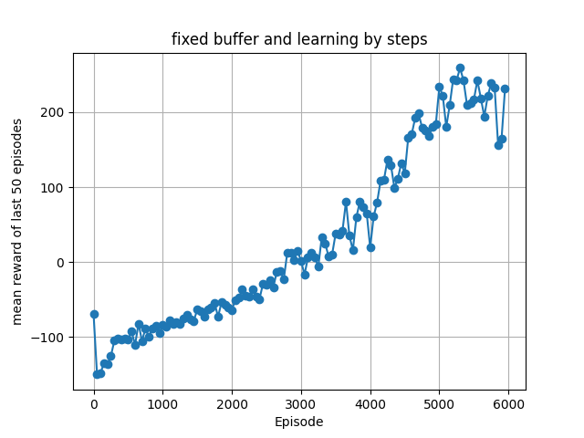  

## Mean rewards  

- Episode 0.0: -69.82, epsilon: 0.90  
- Episode 500.0: -103.06, epsilon: 0.82  
- Episode 1000.0: -83.92, epsilon: 0.74  
- Episode 1500.0: -63.10, epsilon: 0.66  
- Episode 2000.0: -63.93, epsilon: 0.58  
- Episode 2500.0: -29.84, epsilon: 0.50  
- Episode 3000.0: 1.74, epsilon: 0.42  
- Episode 3500.0: 37.62, epsilon: 0.34  
- Episode 4000.0: 19.19, epsilon: 0.26  
- Episode 4500.0: 118.13, epsilon: 0.18  
- Episode 5000.0: 233.98, epsilon: 0.10  
- Episode 5500.0: 217.03, epsilon: 0.10  
- Episode 5950.0: 231.89, epsilon: 0.10  
---

## EVALUATION: 8-64-relu-64-relu-4 trained network 

network file name: save1.pth  
note: this was evaluation of previously trained network with bigger buffer and updating done by x-steps and not x-episodes. Network performed very well in almost every trial  

Number of evaluation episodes: 10  
## Rewards  
264.51  
-9.83  
260.74  
220.15  
289.63  
233.75  
230.54  
257.33  
218.62  
257.41  
---

## EVALUATION: Random_baseline_test

random actions (random baseline)?: True  
network file name: save1.pth   
note: this was test of random model action choosing (randint(0,3)) for comparison with trained models  
Number of evaluation episodes: 10   
## Rewards  
-302.39  
-78.35  
-85.41  
-388.80  
-488.92  
-263.10  
-263.32  
-104.85  
-132.61  
-181.27  
---

## REPORT: test of reworked saving and reporting modules
Report date: 2026:05:31:18:07  

network saved as: test_new_format_1.pth  

## REPORT: 64_RELU (worse result)  
Report date: 2026:05:31:20:20  

network saved as: 64_relu.pth  
best reward scored by network: **165.17830813029695**  
note: This time model with same parameters performed slightly worse, perhaps because of collapse of rewards in the middle, akthough model quickly bounce back. Additional tests are needed to determine if this was due to random chance or there is some problem with the model  
 
### network details 
Input size: 8  
First hidden layer size: 64  
Second hidden layer: 64  
activation function: ReLU  
output size: 4  
network 'graph': 8 -> 64 -> ReLU -> 64 -> ReLU -> 4  

### training details  
Number of training episodes: 6000  
Buffer size: 50000  
Batch size: 64  
Target network updated each 1000 steps   
 
### Q learning parameters  
Gamma: 0.99  
Initial epsilon: 0.9   
Epsilon lowered each episode by 0.00016  
Minimal epsilon: 0.1   
Learning rate: 0.001  

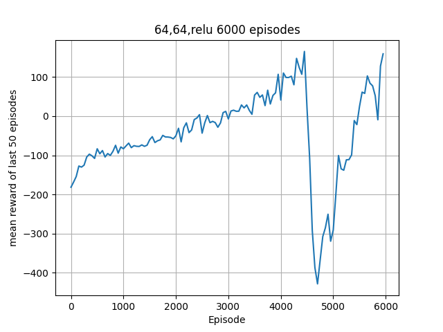  

### Mean rewards  

- Episode 0: -181.44, epsilon: 0.90  
- Episode 500: -83.30, epsilon: 0.82  
- Episode 1000: -83.20, epsilon: 0.74  
- Episode 1500: -60.33, epsilon: 0.66  
- Episode 2000: -50.12, epsilon: 0.58  
- Episode 2500: -43.42, epsilon: 0.50  
- Episode 3000: -7.07, epsilon: 0.42  
- Episode 3500: 53.80, epsilon: 0.34  
- Episode 4000: 41.13, epsilon: 0.26  
- Episode 4500: 19.36, epsilon: 0.18  
- Episode 5000: -290.75, epsilon: 0.10  
- Episode 5500: 24.53, epsilon: 0.10  

## REPORT: 64_relu second attempt
Report date: 2026:05:31:22:08  

network saved as: 64_relu_2nd.pth  
best reward scored by network: **255.31156125917892**  
note: this was second attempt of network training with this configuration to check if previous collapse was due to random factor or mistake in network architecture  
 
### network details  
Input size: 8  
First hidden layer size: 64  
Second hidden layer: 64  
activation function: ReLU  
output size: 4  
network 'graph': 8 -> 64 -> ReLU -> 64 -> ReLU -> 4  

### training details  
Number of training episodes: 6000  
Buffer size: 50000  
Batch size: 64  
Target network updated each 1000 steps  
 
### Q learning parameters  
Gamma: 0.99  
Initial epsilon: 0.9  
Epsilon lowered each episode by 0.00016  
Minimal epsilon: 0.1  
Learning rate: 0.001  

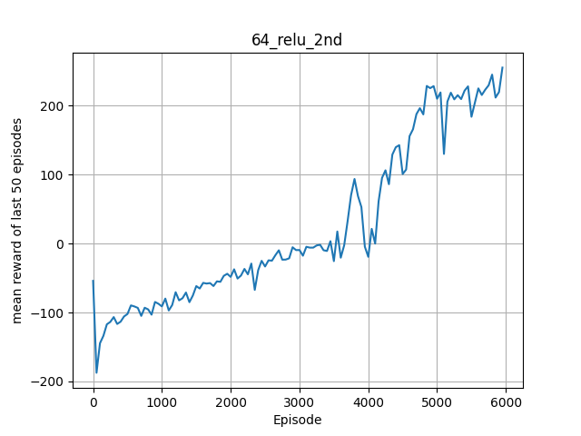  

### Mean rewards  

- Episode 0: -54.07, epsilon: 0.90  
- Episode 500: -102.11, epsilon: 0.82  
- Episode 1000: -91.13, epsilon: 0.74  
- Episode 1500: -61.64, epsilon: 0.66  
- Episode 2000: -48.30, epsilon: 0.58  
- Episode 2500: -33.23, epsilon: 0.50  
- Episode 3000: -9.32, epsilon: 0.42  
- Episode 3500: -25.43, epsilon: 0.34  
- Episode 4000: -19.22, epsilon: 0.26  
- Episode 4500: 100.90, epsilon: 0.18  
- Episode 5000: 210.08, epsilon: 0.10  
- Episode 5500: 183.96, epsilon: 0.10  
---

## REPORT: 128_ReLU  
Report date: 2026:05:31:23:56  

network saved as: 128_ReLU.pth  
best reward scored by network: **256.0488776425706**  
note: This training number of neurons in hidden layer was changed to 128 each hidden layer, network performed slightly better and managed to learn to land well  
 
### network details  
Input size: 8  
First hidden layer size: 128  
Second hidden layer: 128  
activation function: ReLU  
output size: 4  
network 'graph': 8 -> 128 -> ReLU -> 128 -> ReLU -> 4  

### training details  
Number of training episodes: 6000  
Buffer size: 50000  
Batch size: 64  
Target network updated each 1000 steps  
 
### Q learning parameters  
Gamma: 0.99  
Initial epsilon: 0.9  
Epsilon lowered each episode by 0.00016  
Minimal epsilon: 0.1  
Learning rate: 0.001  

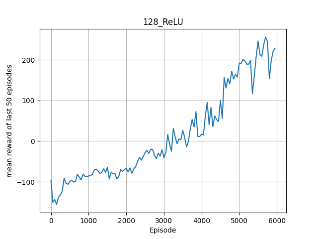  

### Mean rewards  

- Episode 0: -96.14, epsilon: 0.90  
- Episode 500: -99.58, epsilon: 0.82  
- Episode 1000: -85.77, epsilon: 0.74  
- Episode 1500: -64.34, epsilon: 0.66  
- Episode 2000: -66.78, epsilon: 0.58  
- Episode 2500: -28.21, epsilon: 0.50  
- Episode 3000: -40.56, epsilon: 0.42  
- Episode 3500: 26.58, epsilon: 0.34  
- Episode 4000: 17.17, epsilon: 0.26  
- Episode 4500: 100.55, epsilon: 0.18  
- Episode 5000: 192.07, epsilon: 0.10  
- Episode 5500: 246.39, epsilon: 0.10  
---

## EVALUATION: 128_ReLU eval  

Evaluation date: 2026:06:01:00:13  

random actions (random baseline)?: False  
network file name: trained_networks/128_ReLU.pth  
Number of evaluation episodes: 10  
note: model performed very well, landing each time, even when was very thrown off at the beggining  

### network details
Input size: 8  
First hidden layer size: 128  
Second hidden layer: 128  
activation function: ReLU  
output size: 4  
network 'graph': 8 -> 128 -> ReLU -> 128 -> ReLU -> 4  

### training details  
Number of training episodes: 6000  
Buffer size: 50000  
Batch size: 64  
Target network updated each 1000 steps  
 
### Q learning parameters
Gamma: 0.99  
Initial epsilon: 0.9  
Epsilon lowered each episode by 0.00016  
Minimal epsilon: 0.1  
Learning rate: 0.001  

### Rewards  
277.68  
205.81  
266.70  
213.16  
247.04  
213.68  
274.73  
262.64  
205.34  
224.97  

### EVALUATION: 64_ReLU  

Evaluation date: 2026:06:01:00:15  

random actions (random baseline)?: False  
network file name: trained_networks/64_relu_2nd.pth  
Number of evaluation episodes: 10  
note: Model landed flawlessly between the poles each time, subjectively doing it more stylish than 128 neuron counterpart  

### network details
Input size: 8  
First hidden layer size: 64  
Second hidden layer: 64  
activation function: ReLU  
output size: 4  
network 'graph': 8 -> 64 -> ReLU -> 64 -> ReLU -> 4  

### training details  
Number of training episodes: 6000  
Buffer size: 50000  
Batch size: 64  
Target network updated each 1000 steps  
 
### Q learning parameters ===
Gamma: 0.99  
Initial epsilon: 0.9  
Epsilon lowered each episode by 0.00016  
Minimal epsilon: 0.1  
Learning rate: 0.001  

### Rewards  
306.85  
270.25  
263.94  
265.54  
244.04  
266.60  
227.05  
278.00  
251.34  
258.41    

  ## TRAINING REPORT: 64->128 600 episode training  
  Report date: 2026.06.03 14:20  

  network saved as: 64_128_600_episodes.pth  
  best reward scored by network: **213.27808011889203**  
  note: Initially this test was supposed to train a "bad" network, but it performed really well and have almost same best score as their 6000 episode trained counterparts  

  ### network details  
  Input size: 8  
  First hidden layer size: 64  
  Second hidden layer: 128  
  activation function: ReLU  
  output size: 4  
  network 'graph': 8 -> 64 -> ReLU -> 128 -> ReLU -> 4  

  ### training details  
  Number of training episodes: 600  
  Buffer size: 50000  
  Batch size: 64  
  Target network updated each 1000 steps  

  ### Q learning parameters  
  Gamma: 0.99  
  Initial epsilon: 0.9  
  Epsilon lowered each episode by 0.0018  
  Minimal epsilon: 0.1  
  Learning rate: 0.001  

  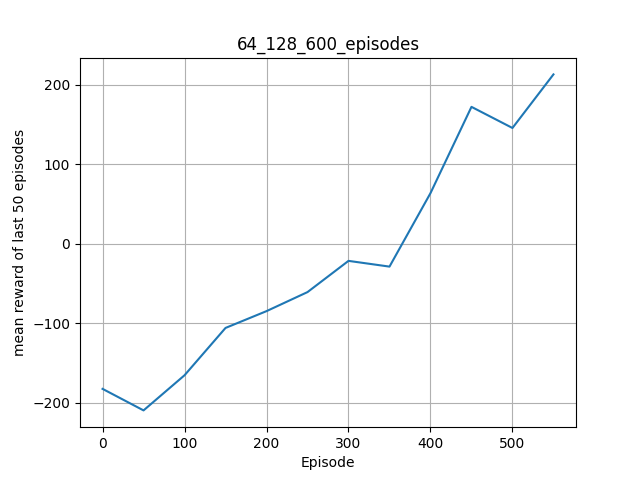  

  ### Mean rewards  

  - Episode 0: -182.49, epsilon: 0.90  
  - Episode 500: 145.84, epsilon: 0.10  
    

  ## TRAINING REPORT: 32_32, 600 episodes  
  Report date: 2026.06.03 15:55  

  network saved as: 32_32, 600 episodes.pth  
  best reward scored by network: **53.864260453528**  
  note: This network had less neurons and performed significantly worse, episodes with rewards bellow 200 are not considered solutions.  

  ### network details  
  Input size: 8  
  First hidden layer size: 32  
  Second hidden layer: 32  
  activation function: ReLU  
  output size: 4  
  network 'graph': 8 -> 32 -> ReLU -> 32 -> ReLU -> 4  

  ### training details  
  Number of training episodes: 600  
  Buffer size: 50000  
  Batch size: 64  
  Target network updated each 1000 steps  

  ### Q learning parameters  
  Gamma: 0.99  
  Initial epsilon: 0.9  
  Epsilon lowered each episode by 0.0018  
  Minimal epsilon: 0.1  
  Learning rate: 0.001  

  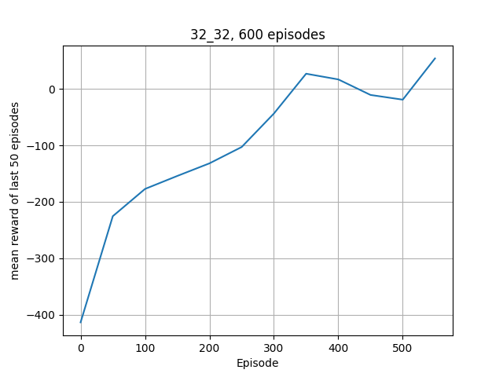  

  ### Mean rewards  

  - Episode 0: -413.38, epsilon: 0.90  
  - Episode 500: -19.13, epsilon: 0.10  
  ---  

  ## EVALUATION: 64_relu with collapse 

  Evaluation date: 2026, 06, 03, 15:58  

  random actions (random baseline)?: False  
  network file name: trained_networks/64_relu.pth  
  Number of evaluation episodes: 5  
  note: Evaluation of 64-64 relu network that collapsed during training but quickly bounced back  

  ### Evaluation video:  
  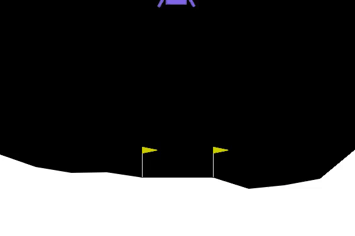  

### network details  
  Input size: 8  
  First hidden layer size: 64  
  Second hidden layer: 64  
  activation function: ReLU  
  output size: 4  
  network 'graph': 8 -> 64 -> ReLU -> 64 -> ReLU -> 4  

  ### training details  
  Number of training episodes: 6000  
  Buffer size: 50000  
  Batch size: 64  
  Target network updated each 1000 steps  

  ### Q learning parameters  
  Gamma: 0.99  
  Initial epsilon: 0.9  
  Epsilon lowered each episode by 0.00016  
  Minimal epsilon: 0.1  
  Learning rate: 0.001  

  ### Rewards  
  -1469.17  
  199.73  
  -1335.33  
  205.46  
  180.49  
  ---  

  ## EVALUATION: 64_relu 2nd train 

  Evaluation date: 2026, 06, 03, 16:02  

  random actions (random baseline)?: False  
  network file name: trained_networks/64_relu_2nd.pth  
  Number of evaluation episodes: 5  
  note: Second test to check if network always collapses or was it very bad luck. It performed very well  

  ### Evaluation video:  
  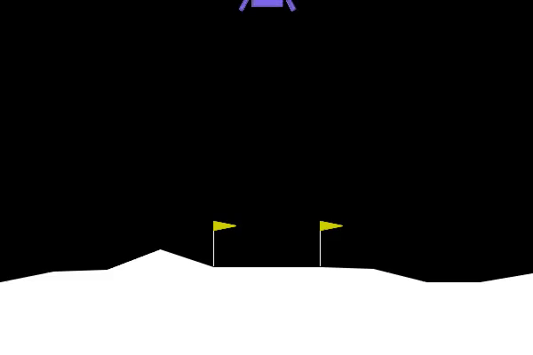  

### network details  
  Input size: 8  
  First hidden layer size: 64  
  Second hidden layer: 64  
  activation function: ReLU  
  output size: 4  
  network 'graph': 8 -> 64 -> ReLU -> 64 -> ReLU -> 4  

  ### training details  
  Number of training episodes: 6000  
  Buffer size: 50000  
  Batch size: 64  
  Target network updated each 1000 steps  

  ### Q learning parameters  
  Gamma: 0.99  
  Initial epsilon: 0.9  
  Epsilon lowered each episode by 0.00016  
  Minimal epsilon: 0.1  
  Learning rate: 0.001  

  ### Rewards  
  264.22  
  266.79  
  285.84  
  248.66  
  282.70  
  ---  

  ## EVALUATION: 128_relu 

  Evaluation date: 2026, 06, 03, 16:04  

  random actions (random baseline)?: False  
  network file name: trained_networks/128_ReLU.pth  
  Number of evaluation episodes: 5  
  note: Test of network with higher ammount of neurons  

  ### Evaluation video:  
  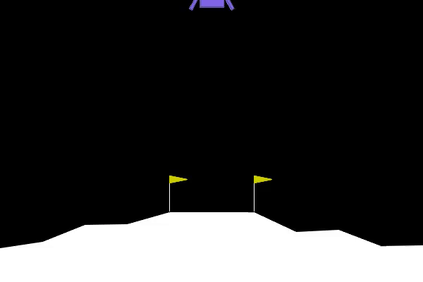  

### network details  
  Input size: 8  
  First hidden layer size: 128  
  Second hidden layer: 128  
  activation function: ReLU  
  output size: 4  
  network 'graph': 8 -> 128 -> ReLU -> 128 -> ReLU -> 4  

  ### training details  
  Number of training episodes: 6000  
  Buffer size: 50000  
  Batch size: 64  
  Target network updated each 1000 steps  

  ### Q learning parameters  
  Gamma: 0.99  
  Initial epsilon: 0.9  
  Epsilon lowered each episode by 0.00016  
  Minimal epsilon: 0.1  
  Learning rate: 0.001  

  ### Rewards  
  162.67  
  237.28  
  48.04  
  268.71  
  270.33  
  ---  

  ## EVALUATION: 64_128, 600 episodes 

  Evaluation date: 2026, 06, 03, 16:07  

  random actions (random baseline)?: False  
  network file name: trained_networks/64_128_600_episodes.pth  
  Number of evaluation episodes: 5  
  note: Test of network trained on 600 episodes instead of 6000. Epsilon substraction adjusted  

  ### Evaluation video:  
  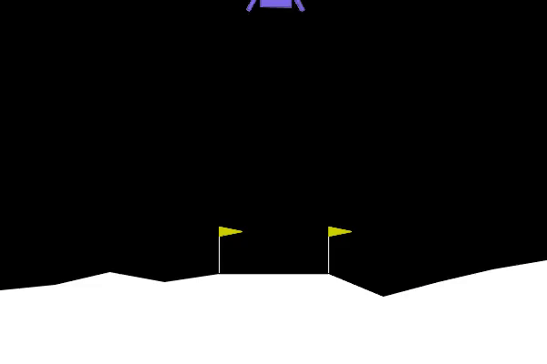  

### network details  
  Input size: 8  
  First hidden layer size: 64  
  Second hidden layer: 128  
  activation function: ReLU  
  output size: 4  
  network 'graph': 8 -> 64 -> ReLU -> 128 -> ReLU -> 4  

  ### training details  
  Number of training episodes: 600  
  Buffer size: 50000  
  Batch size: 64  
  Target network updated each 1000 steps  

  ### Q learning parameters  
  Gamma: 0.99  
  Initial epsilon: 0.9  
  Epsilon lowered each episode by 0.0018  
  Minimal epsilon: 0.1  
  Learning rate: 0.001  

  ### Rewards  
  283.76  
  209.32  
  215.60  
  270.96  
  299.25  
  ---  

  ## EVALUATION: 32_32 600 episodes network 

  Evaluation date: 2026, 06, 03, 16:10  

  random actions (random baseline)?: False  
  network file name: trained_networks/32_32, 600 episodes.pth  
  Number of evaluation episodes: 5  
  note: Test of network with lesser ammount of neurons, performed bad  

  ### Evaluation video:  
  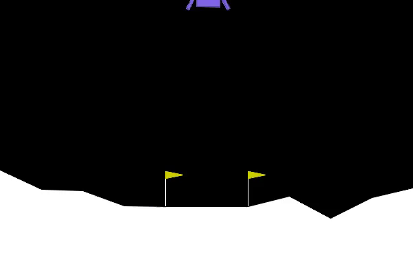  

### network details  
  Input size: 8  
  First hidden layer size: 32  
  Second hidden layer: 32  
  activation function: ReLU  
  output size: 4  
  network 'graph': 8 -> 32 -> ReLU -> 32 -> ReLU -> 4  

  ### training details  
  Number of training episodes: 600  
  Buffer size: 50000  
  Batch size: 64  
  Target network updated each 1000 steps  

  ### Q learning parameters  
  Gamma: 0.99  
  Initial epsilon: 0.9  
  Epsilon lowered each episode by 0.0018  
  Minimal epsilon: 0.1  
  Learning rate: 0.001  

  ### Rewards  
  -255.17  
  -27.72  
  135.99  
  190.24  
  -26.31  
  ---  

  